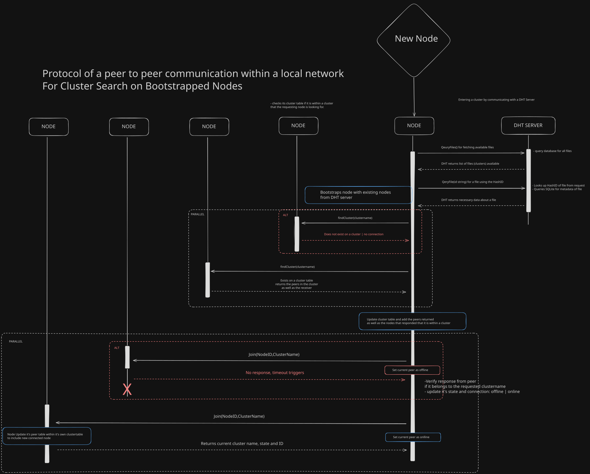
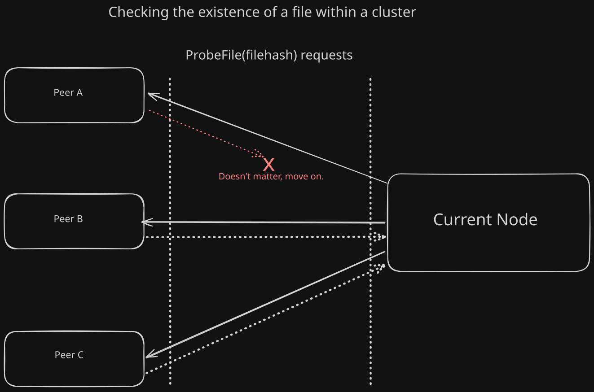

# Local-P2P

> (Work in Progress)

A Local peer to peer file distribution network written in GO.
This project is an inspiration to the classical peer to peer protocol except that it does not adhere
to any specifications of any well established protocols like BitTorrent, but it does implement 
some of the concepts used in those fields eg: DHT servers and whatnot.

This project is moreso for trying to build things from my own understanding and not be used as if 
it were to compete with any robust protocols out there. while also being very simplistic and 
rudimentary.

#### Todo:
- Implementing the Leeching request
- Fixing Data Piece Distribution
- Peer Coordination for Distributing Data Pieces
- DHT Server
- CLI for Client and Server
- Finish Client Actions
- Reestablishing connection among peers with system failures

## Communication

### The Consensus of Communication between DHT Server, Client Nodes and Cluster Peers:

Before a Node can be able to communicate with the other neighboring Nodes within the network, it needs to establish
a UDP connection with the DHT server, there are multiple actions a node can execute with the DHT Server:

Node Actions to DHT Server

- Querying for files
- Statuses of the Nodes within the network
- Promote itself as Initial Seeder (uploading its file meta data to the DHT Server)
- might add more...




``` 
ClientNode sends a query for existing list of files to DHT Server

DHT Server sends back a reponse of the list of files

ClientNode bootstraps the list of existing nodes provded by the DHT Server

ClientNode sends a request that fans-out to all neighbors for finding a cluster within the cluster table of each neighbors

Neighbors return peers on the cluster

ClientNode creates a cluster from retrieved list of peers and populates the cluster.

ClientNode can then probe for the existence of a file on each peer

On Return of response the ClientNode sends out a Leech request to the peers within a cluster

```


### Handling Failed Request and Reponses:

In some cases where any of the peers fail to respond, which could mean anything eg: system failure, program crashing etc...

> Heads up! this is bad because once the other peer crashes, we should handle the socket appropriately and close it if ever
> we are not able to establish any connection to it or an error resembling any error on the host system was returned
> only then do we close the socket. (will update the diagram in the future!)


The idea was it would've been better to just move on and forget about it to make things simpler.
To reduce unneccessary overhead of trying to handle errors from peers that refuse to cooperate in a cluster, so the sentence 
"Doesn't matter, move on." is what failed requests/reponses is trying to embody.




## File Data Segmentation

Handling file segmentation depends on the size of the file and the number of the peers that are contributing to seeding it.

The current build assumes that the file will be segmented by the DHT server by populating the Size and BlockSize fields, the Pieces is decided by dividing the total length of the File by the BlockSize.

> BlockSize is the current page size in linux which is 4KB since a file could contain Gigabytes of data so it is much more safer to use Memory Mapped File Access to save memory overhead and only load on page-demand
> Planning to increase the page size access for a more faster streaming of bytes from peer to peer but it should be page aligned by multiple of 4KB. 


```go
type FileMetaData struct {
	Name      string
	Hash      string
	Size      uint64
	BlockSize int64
    Pieces    int64
}
```
So for every request to LEECH By the ClientNode to a Peer:

```go
// used for RPC Message by requester
type FileRequest struct {
	Pieces    int64
	Hash      string // should be 16bit string
	Size      int64
	Offset    int64
	BlockSize int64
}
```

The Leeched peer responds with a header of the current block from the file and assigns the Offset which is just blockSize = Offset,
so for the next call to request the next piece would just be the Offset from the previous iteration and the block will be as is.


```go
// used for RPC Message by receiver to reply to the iniator
type PieceHeader struct {
	PieceSize     int64       // from blockSize or remaining bytes
	Offset        int64       // current bytes created / block
	TotalPieces   int64       // size in bytes / block
	ClusterName   ClusterName // string ID of the file to be sent
}
// Payload body appended
```

The ClientNode then checks if the number of pieces that has arrived is equal to the TotalPieces needed for the file, but if not 
it will keep calling Leech to request for the next piece using the existing PieceHeader information that was sent as a response
for the next Offset of the file.


## How to run

> Not yet implemented
